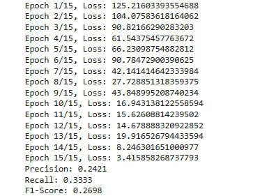

# ЛАБОРАТОРНАЯ РАБОТА №2
## Отчет по лабораторной работе
### 1. Теоретическая база
Цель работы — научиться работать с предобученными моделями, использовать их эмбеддинги для создания новых моделей и решать задачу классификации звуков. В данной работе использована модель AudioClassifier, которая представляет собой простую нейронную сеть с двумя полносвязными слоями.

Модель AudioClassifier:

1. Входной слой (fc1):

- Полносвязный слой с размером входных данных `input_size`, где

**`input size = n_mels * target_length`**, 

где `n_mels` — _количество Mel-полос_,

`target_length` — _фиксированная длина Mel Spectrogram_.

- Размер выходных данных: 512.

- Активация: ReLU (_Rectified Linear Unit_) по формуле:

***ReLu(x) = max(0, x)***

- ReLu применяется к выходу первого полносвязного слоя (fc1).
- Она обнуляет все отрицательные значения и оставляет положительные без изменений.
- Это нелинейная функция, которая позволяет модели изучать сложные зависимости.

2. Выходной слой (fc2):

- Полносвязный слой с размером входных данных 512 и выходных данных `num_classes` (_количество классов для классификации_).

- Активация: отсутствует (используется для вывода сырых значений перед применением функции потерь).

### 2. Описание разработанной системы
Принцип работы системы:
- Используется датасет с ссылками на видео и классами с аннотациями для них.
- Классы и аннотации преобразуются в эмбеддинги с помощью нашей модели AudioClassifier.
- Эмбеддинги используются в качестве входных данных для нейронной сети.
- Нейронная сеть обучается на тренировочной выборке и тестируется на тестовой выборке.
- Оценка качества модели проводится с использованием метрик Precision, Recall и F1-score.

Архитектура:
- Входные данные: классы и аннотации к видео.
- Модель: простая нейронная сеть с двумя полносвязными слоями.
- Функция потерь: ***CrossEntropyLoss***.
- Оптимизатор: ***Adam***.
- Инфраструктура: ***yt_dlp***, ***librosa***, ***ffmpeg***.

Алгоритм работы:
1. Загрузка данных (датасет с классами, аннотациями и ссылками на видео).
2. Генерация эмбеддингов: извлечение Mel Spectrogram из аудио.
3. Обучение модели: нейронная сеть обрабатывает эмбеддинги, минимизирует функцию потерь и обновляет веса.
4. Оценка: После обучения модель тестируется на выборке, вычисляется **F1-score**, **Recall** и **Precision**.

### 3. Результаты работы и тестирования системы
Пример выводов в процессе обучения:

Основные результаты:

Простая нейронная сеть на основе эмбеддингов показала неудовлетворительное качество на задаче классификации.
- Метрика **Precision** для тестовой выборки составила **0.2421**, что означает, что только **24,21%** из всех предсказанных моделью положительных классов действительно являются правильными.
- Метрика **Recall** для тестовой выборки составила **0.3333**, что означает, что модель правильно идентифицировала только около **33.33%** всех реальных положительных объектов.
- Метрика **F1-score** для тестовой выборки составила 0.2698, что указывает на то, что модель плохо справляется с задачей классификации.

### 4. Выводы по работе
Простая архитектура нейронной сети способна достичь удовлетворительной точности при условии качественного представления входных данных.
Важную роль играет корректная предобработка датасета, так как она влияет на качество извлекаемых эмбеддингов.
PyTorch предоставляет удобные инструменты для построения и обучения моделей.

### 5. Использованные источники

PyTorch Documentation [электронный ресурс]. – Режим доступа: https://pytorch.org/docs/stable/ (дата обращения: 27.12.2024).

yt-dlp Documentation [электронный ресурс]. - Режим доступа: https://pypi.org/project/yt-dlp/2021.3.7/ (дата обращения: 27.12.2024).

sklearn.metrics Documentation [электронный ресурс]. – Режим доступа: https://scikit-learn.org/stable/modules/model_evaluation.html (дата обращения: 27.12.2024).
